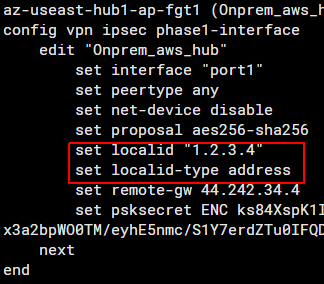

# IPSEC VPN with FGT in Azure - FAQ

## ReadMe main objectives
* Explain how to configure Azure components to setup VPN on the FortiGate

## FortiGate Active/Passive LB Sandwich with Azure External LB and Internal LB
_https://github.com/fortinet/azure-templates/tree/main/FortiGate/Active-Passive-ELB-ILB_

* Create Load Balancing Rules for UDP 500 and UDP 4500 as explained in this [link](https://github.com/fortinet/azure-templates/blob/main/FortiGate/Active-Passive-ELB-ILB/doc/config-inbound-connections.md)

* DO NOT enabled **Floating IP** on the LB rules, since the FortiGate does not listen on the public ip for incoming VPN communications.

    

* Make sure that NAT Traversal is set to **Enable** or  **Forced** on both the FortiGate and the peer

* If the tunnel is failing with the error message **received notify type AUTHENTICATION_FAILED** it is likely that the local-id set by the FortiGate does not match the local id expected by the peer.  To resolve this issue you can configure the FortiGate to set a specific localid-type and value to match the value exptected by the peer.
    The example below shows local-id type set to address and the value set to the public ip.
    The localid-type and value can be set to fqdn, a string or auto, for more information please consult the CLI guide [here](https://docs.fortinet.com/document/fortigate/7.2.0/cli-reference/370620/config-vpn-ipsec-phase1-interface)

    

## FortiGate Active/Active LB Sandwich with Azure External LB and Internal LB

_https://github.com/fortinet/azure-templates/tree/main/FortiGate/Active-Active-ELB-ILB_

* The setup of Active/Active Fortigate (link above) requires that each FortiGate is accessible separately to your on-prem device to establish an IPSEC VPN tunnel. To expose each FortiGate separately through Azure Public Load Balancer, please create **2 Inbound NAT rules per FGT**  as shown in the screenshot below. **Each FortiGate must have its own frontend ip address so you should have at least 2 public ip attached to the Load Balancer**

    

