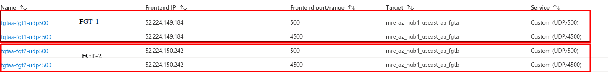
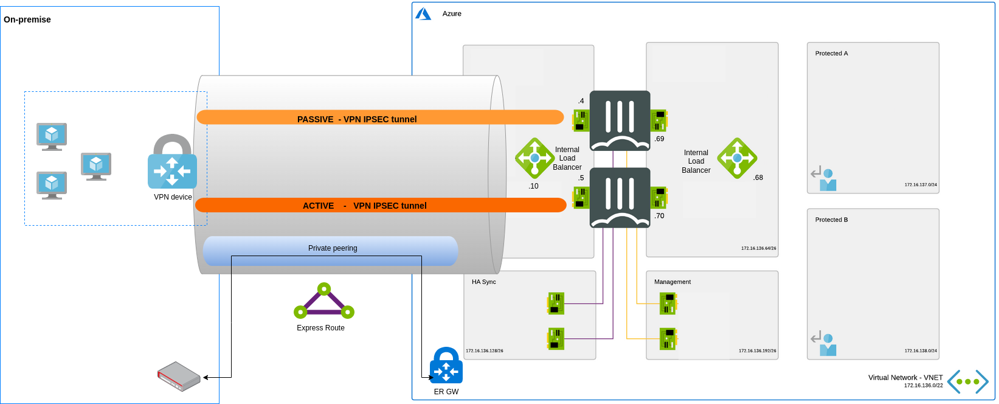
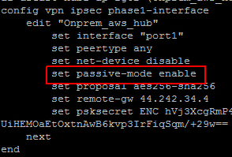
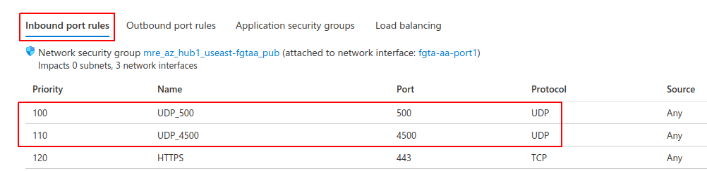

# IPSEC VPN with FGT in Azure - FAQ

## Main objectives of this document
* Explain how to configure Azure components to establish a ipsec vpn tunnel between the FortiGates in Azure and an on-premise device
* List some troubleshooting options.


## FortiGate Active/Passive with Azure ELB and ILB
_https://github.com/fortinet/azure-templates/tree/main/FortiGate/Active-Passive-ELB-ILB_


### <ins>Azure</ins>

* To enable IPSEC, you need to create Load Balancing Rules for UDP 500 and UDP 4500 as explained in this [link](https://github.com/fortinet/azure-templates/blob/main/FortiGate/Active-Passive-ELB-ILB/doc/config-inbound-connections.md#configuration---ipsec)

* Do not enabled **Floating IP** on the IPSEC VPN LB rules (UDP 500 and UDP 4500). When **Floating IP** is enabled, Azure LB Azure changes the IP address mapping to the Frontend IP address of the Load Balancer  instead of backend instance's IP, as explained [here](https://docs.microsoft.com/en-us/azure/load-balancer/load-balancer-floating-ip).

    

    > since the FortiGates are not aware and are not configured to listen on the public ip for incoming VPN connections, **Floating IP** should not be enabled.


### <ins>FortiGate</ins>

* Make sure you have a policy configured referencing the VPN

* Make sure that NAT Traversal is set to **Enable** or  **Forced** on both the FortiGate in Azure and on the remote peer

    

* If the tunnel is failing with the error message **received notify type AUTHENTICATION_FAILED** or **RETRANSMIT_AUTH** it is likely that the local-id set by the FortiGate does not match the local id expected by the peer.  To resolve this issue you can configure the FortiGate to set a specific localid-type and value. Please ensure that the vpn peer is configured to match this value in the peer-id field
    The example below shows local-id type and value set to fqdn.
    The localid-type and value can be set to fqdn, a string or auto, for more information please consult the CLI guide [here](https://docs.fortinet.com/document/fortigate/7.2.0/cli-reference/370620/config-vpn-ipsec-phase1-interface)

    

    > Do not set the localid value to the private ip address of the FortiGate nic, since upon failover the ip address of the new primay FortiGate will be a diffrent one.

## FortiGate Active/Active with Azure ELB and ILB
_https://github.com/fortinet/azure-templates/tree/main/FortiGate/Active-Active-ELB-ILB_


### <ins>Azure</ins>

* The setup of Active/Active FortiGates in Azure (link above) requires that each FortiGate is accessible separately to your remote peer to establish an IPSEC VPN tunnel. To expose each FortiGate separately through Azure Public Load Balancer, please create **2 Inbound NAT rules per FGT**  as shown in the screenshot below. **Each FortiGate must have its own frontend ip address so you should have at least 2 public ip attached to the Load Balancer**

    

* To ensure that both FortiGate in Azure are be able to initiate the tunnel negotiation, ensure that Azure external has outbound NAT rules for both FortiGate on UDP traffic.  **Ensure that the same public ip address is used for outgoing traffic for each FortiGate**

    

### <ins>FortiGate</ins>

* Make sure that NAT Traversal is set to **Enable** or  **Forced** on both the FortiGate in Azure and on the remote peer. See screenshot in the previous [section](https://github.com/mremini/fgt-in-azure-ipsec-troubleshoot#fortigate)

* If needed, configure the localid parameter on the FortiGates and on the remote peer. See screenshot in the previous [section](https://github.com/mremini/fgt-in-azure-ipsec-troubleshoot#fortigate)

* Make sure you have a policy configured referencing the VPN.

* Ensure that **SNAT** is enabled on the FortiGate VPN policies to ensure traffic symmetry.

## FortiGate Active/Passive LB Sandwich with Azure Internal LB only
_https://github.com/movinalot/fortinet-azure-solutions/tree/main/FortiGate/AvailabilityZones/Active-Passive-ILB-ILB-AZ_

* The most common scenario for setting up an ipsec VPN tunnel with an "internal" firewall is to estabish an ipsec vpn tunnel over express route to ensure end to end ecnrypted connectity and a secure path for data.

* Unlike the A/P ELB and ILB deployment where the public load balancer is used to load balance IPSEC VPN traffic  to the primary FortiGate, in this scenario the Internal LB cannot be used to load balance IPSEC VPN if you want the FortiGate to be able to initiate IPSEC VPN tunnel negotiation.

* The recommendation is to establish an ipsec VPN directly to each FortiGate

    

    > Azure ILB by design does not SNAT traffic. If using Azure Internal LB for ipsec vpn, when the FortiGate in Azure tries to initiate the tunnel to the on-premise device it won't be snatted by the Azure internal LB, hence your on-premise device will see the FortiGate IP address coming to establish the ipsec VPN instead of the Azure ILB frontend ip address, causing the tunnel to fail.

* If you want your on-premise device to terminate the ipsec vpn on the ILB frontendip address, then the FortiGate ipsec vpn should be set to **passive** mode in order to not initiate the tunnel establishement.

    

## Troubleshooting

### <ins>Azure</ins>
* For FortiGate A/P LB sandwich, ensure that UDP500 and UDP4500 Load balancing rules are functionnal
  1. In Azure, go to the Azure external load balancer, click on Insights and verify that the primary FortiGate is marked as healthy (answering health probes). The other FortiGate is secondary so should be marked as unhealthy

      

  2. Check on the FortiGate if udp 500 and udp 4500 are reaching the FortiGate from the on-premise device. Use the command ```diagnose sniffer packet any 'port 500 or port 4500' 4 0 a ```  or the following command if you want to only capture traffic coming from your peer. Replace x.x.x.x with the actual peer ip ```diagnose sniffer packet any '(port 500 or port 4500) and host x.x.x.x' 4 0 a ```

      

  3. If the tcpdump does not show any packet. Please check your NSG rules.
        

### <ins>FortiGate</ins>
* To check log relating to vpn events on the FortiGate go to Log & Report, Events and then clickk on VPN events
      

* Click on the error message to view further details
      

* For advanced troubleshooting, use the commands below

```
diagnose vpn ike filter name <phase1 name>
diagnose debug application ike -1
diagnose debug enabled
```

* For further IPSEC vpn troubleshooting tips, please check this [kb article](https://community.fortinet.com/t5/FortiGate/Technical-Tip-Troubleshooting-IPsec-VPNs/ta-p/195955) and [this one](https://community.fortinet.com/t5/FortiGate/Troubleshooting-Tip-IPSEC-Tunnel-debugging-IKE/ta-p/190052)